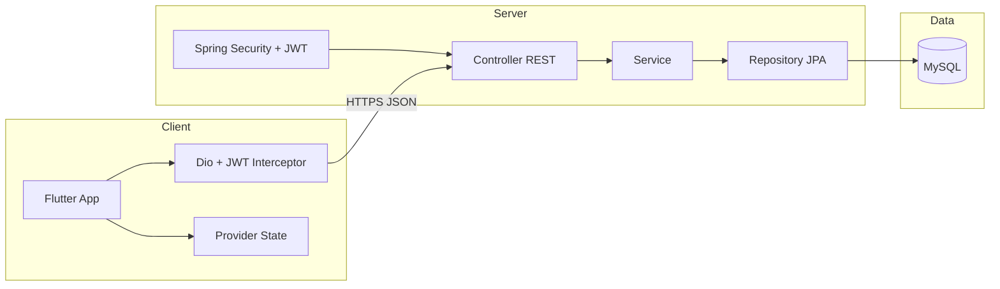
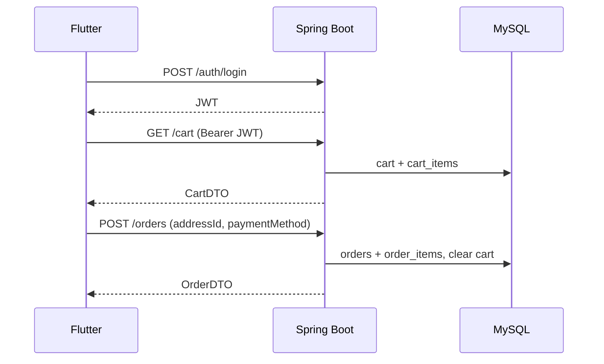

# Giai đoạn 1 — Phân tích yêu cầu & thiết kế hệ thống

**Đề tài:** Ứng dụng đặt đồ uống trên thiết bị di động (Flutter + Spring Boot + MySQL, RESTful)

**Đối tượng:** Sinh viên năm 2 — Hệ thống thông tin

---

## 1. Phân tích yêu cầu

### 1.1. Bối cảnh

Người dùng cần xem menu đồ uống, tùy chọn size/topping, đặt hàng và theo dõi trạng thái. Quản trị viên cần quản lý danh mục, sản phẩm, topping, đơn hàng và xem thống kê cơ bản.

### 1.2. Stakeholder

| Đối tượng | Mục tiêu |
|-----------|----------|
| **Khách hàng (USER)** | Đăng ký/đăng nhập, duyệt menu, giỏ hàng, thanh toán, theo dõi đơn, đánh giá |
| **Quản trị (ADMIN)** | CRUD dữ liệu nền, cập nhật trạng thái đơn, thống kê đơn/doanh thu |

### 1.3. Ràng buộc công nghệ (bắt buộc)

| Tầng | Công nghệ |
|------|-----------|
| Mobile | Flutter, Dart, Dio, Provider |
| Backend | Java 21, Spring Boot, Maven |
| DB | MySQL |
| API | RESTful, JSON |
| ORM | Spring Data JPA + Hibernate |
| Bảo mật | Spring Security + JWT |

### 1.4. Yêu cầu phi chức năng (đơn giản, phù hợp BTL)

- API trả JSON thống nhất (mã HTTP chuẩn).
- Mật khẩu lưu dạng hash (BCrypt).
- JWT cho các API cần đăng nhập; phân quyền `USER` / `ADMIN`.
- Flutter: loading, thông báo lỗi API, snackbar khi thêm giỏ/đặt hàng thành công.
- Không hard-code menu trên app — lấy từ API.

### 1.5. Phạm vi ngoài (có thể ghi trong báo cáo)

- Thanh toán online thật (VNPay, Momo) — chỉ **chọn phương thức** (COD, chuyển khoản giả lập).
- Giao hàng GPS realtime — chỉ **trạng thái đơn** (PENDING → … → DELIVERED).
- Push notification — tùy chọn mở rộng.

---

## 2. Đề xuất chức năng (theo module)

### 2.1. Module xác thực & hồ sơ

| STT | Chức năng | Mô tả ngắn |
|-----|-----------|------------|
| 1 | Đăng ký | Email/SĐT, mật khẩu, họ tên |
| 2 | Đăng nhập | Trả JWT (access token) |
| 3 | Đăng xuất | Client xóa token; server có thể blacklist (tùy chọn, giai đoạn sau có thể bỏ qua) |
| 4 | Xem/sửa thông tin cá nhân | GET/PUT `/users/me` |

### 2.2. Module catalog (công khai hoặc USER)

| STT | Chức năng | Mô tả |
|-----|-----------|-------|
| 5 | Danh mục | List category |
| 6–8 | Sản phẩm | List, tìm theo tên, lọc theo `categoryId` |
| 9 | Chi tiết sản phẩm | Giá theo size, danh sách topping gợi ý |
| 10–11 | Size & topping | Size lưu trên sản phẩm (bảng `product_sizes`); topping many-to-many |

### 2.3. Module giỏ hàng

| STT | Chức năng | Mô tả |
|-----|-----------|-------|
| 12–14 | Giỏ hàng | Mỗi user một cart; item = product + size + toppings + quantity + ghi chú |

### 2.4. Module đơn hàng

| STT | Chức năng | Mô tả |
|-----|-----------|-------|
| 15–17 | Checkout | Chọn địa chỉ, phương thức thanh toán |
| 18–20 | Theo dõi & lịch sử | List orders, chi tiết, trạng thái |
| 21 | Hủy đơn | Chỉ khi `status = PENDING` |

### 2.5. Module đánh giá

| STT | Chức năng | Mô tả |
|-----|-----------|-------|
| 22 | Review | Sau khi đơn DELIVERED; 1 user / 1 product / 1 order (hoặc 1 lần mua) |

### 2.6. Module quản trị (ADMIN)

| STT | Chức năng |
|-----|-----------|
| 1 | Đăng nhập admin (cùng API login, role ADMIN) |
| 2 | CRUD users (khóa/mở, đổi role — đơn giản) |
| 3–5 | CRUD categories, products (+ sizes), toppings |
| 6–7 | List orders, cập nhật status |
| 8 | Thống kê: số đơn theo trạng thái, doanh thu theo khoảng ngày |

---

## 3. Thiết kế kiến trúc hệ thống

### 3.1. Kiến trúc tổng thể (3 tầng)



### 3.2. Luồng điển hình — Đặt hàng



### 3.3. Cấu trúc thư mục backend (Maven)

```
drink-order-api/
├── pom.xml
└── src/main/java/com/drinkorder/
    ├── DrinkOrderApplication.java
    ├── config/          # CORS, OpenAPI (tùy chọn)
    ├── controller/
    ├── service/
    ├── repository/
    ├── entity/
    ├── dto/
    ├── security/        # JwtFilter, UserDetails, SecurityConfig
    └── exception/       # GlobalExceptionHandler
└── src/main/resources/
    ├── application.yml
    └── data.sql         # seed admin + mẫu (tùy chọn)
```

### 3.4. Cấu trúc thư mục Flutter

```
drink_order_app/
├── lib/
│   ├── main.dart
│   ├── models/
│   ├── services/        # api_client.dart, auth_service.dart, ...
│   ├── providers/
│   ├── screens/
│   ├── widgets/
│   ├── routes/
│   └── utils/           # constants, snackbar, token storage
└── pubspec.yaml
```

### 3.5. Quy ước API response (đề xuất)

**Thành công (200/201):**

```json
{
  "success": true,
  "message": "OK",
  "data": { }
}
```

**Lỗi (4xx/5xx):**

```json
{
  "success": false,
  "message": "Mô tả lỗi",
  "data": null
}
```

Hoặc dùng trực tiếp body DTO không bọc — **chọn một cách** và dùng xuyên suốt (giai đoạn 2 sẽ implement `ApiResponse<T>`).

---

## 4. Thiết kế database

### 4.1. Quy ước chung

- Khóa chính: `BIGINT AUTO_INCREMENT` → map JPA `Long`.
- Thời gian: `created_at`, `updated_at` (DATETIME).
- Soft delete: **không bắt buộc** — có thể dùng `active` BOOLEAN trên product/category.
- Charset: `utf8mb4`.

### 4.2. Bảng `users`

| Cột | Kiểu | Ràng buộc | Ghi chú |
|-----|------|-----------|---------|
| id | BIGINT | PK, AI | |
| email | VARCHAR(255) | UNIQUE, NOT NULL | đăng nhập |
| password | VARCHAR(255) | NOT NULL | BCrypt |
| full_name | VARCHAR(150) | NOT NULL | |
| phone | VARCHAR(20) | NULL | |
| role | ENUM('USER','ADMIN') | NOT NULL, DEFAULT 'USER' | |
| enabled | BOOLEAN | DEFAULT TRUE | |
| created_at | DATETIME | NOT NULL | |
| updated_at | DATETIME | NOT NULL | |

### 4.3. Bảng `categories`

| Cột | Kiểu | Ràng buộc |
|-----|------|-----------|
| id | BIGINT | PK |
| name | VARCHAR(100) | NOT NULL |
| description | VARCHAR(500) | NULL |
| image_url | VARCHAR(500) | NULL |
| active | BOOLEAN | DEFAULT TRUE |
| created_at, updated_at | DATETIME | |

### 4.4. Bảng `products`

| Cột | Kiểu | Ràng buộc |
|-----|------|-----------|
| id | BIGINT | PK |
| category_id | BIGINT | FK → categories(id) |
| name | VARCHAR(200) | NOT NULL |
| description | TEXT | NULL |
| image_url | VARCHAR(500) | NULL |
| active | BOOLEAN | DEFAULT TRUE |
| created_at, updated_at | DATETIME | |

**Ghi chú:** Giá theo size → bảng `product_sizes` (đơn giản hơn JSON trong product).

### 4.5. Bảng `product_sizes`

| Cột | Kiểu | Ràng buộc |
|-----|------|-----------|
| id | BIGINT | PK |
| product_id | BIGINT | FK → products(id), ON DELETE CASCADE |
| size_name | VARCHAR(20) | NOT NULL | S, M, L |
| price | DECIMAL(12,2) | NOT NULL |
| UNIQUE(product_id, size_name) | | |

### 4.6. Bảng `toppings`

| Cột | Kiểu | Ràng buộc |
|-----|------|-----------|
| id | BIGINT | PK |
| name | VARCHAR(100) | NOT NULL |
| price | DECIMAL(12,2) | NOT NULL |
| active | BOOLEAN | DEFAULT TRUE |

### 4.7. Bảng `product_toppings` (N-N)

| Cột | Kiểu | Ràng buộc |
|-----|------|-----------|
| product_id | BIGINT | PK, FK → products |
| topping_id | BIGINT | PK, FK → toppings |

### 4.8. Bảng `addresses`

| Cột | Kiểu | Ràng buộc |
|-----|------|-----------|
| id | BIGINT | PK |
| user_id | BIGINT | FK → users |
| recipient_name | VARCHAR(150) | NOT NULL |
| phone | VARCHAR(20) | NOT NULL |
| address_line | VARCHAR(500) | NOT NULL |
| is_default | BOOLEAN | DEFAULT FALSE |
| created_at | DATETIME | |

### 4.9. Bảng `cart`

| Cột | Kiểu | Ràng buộc |
|-----|------|-----------|
| id | BIGINT | PK |
| user_id | BIGINT | FK → users, UNIQUE | 1 user = 1 cart |

### 4.10. Bảng `cart_items`

| Cột | Kiểu | Ràng buộc |
|-----|------|-----------|
| id | BIGINT | PK |
| cart_id | BIGINT | FK → cart |
| product_id | BIGINT | FK → products |
| product_size_id | BIGINT | FK → product_sizes |
| quantity | INT | NOT NULL, >= 1 |
| note | VARCHAR(255) | NULL |

**Topping trên cart:** bảng `cart_item_toppings` (cart_item_id, topping_id) — tránh lưu chuỗi ID.

### 4.11. Bảng `cart_item_toppings`

| cart_item_id | BIGINT | PK, FK |
| topping_id | BIGINT | PK, FK |

### 4.12. Bảng `orders`

| Cột | Kiểu | Ghi chú |
|-----|------|---------|
| id | BIGINT | PK |
| user_id | BIGINT | FK users |
| address_id | BIGINT | FK addresses (snapshot có thể copy text — giai đoạn 4) |
| status | ENUM | PENDING, CONFIRMED, PREPARING, DELIVERING, DELIVERED, CANCELLED |
| payment_method | ENUM | COD, BANK_TRANSFER |
| payment_status | ENUM | UNPAID, PAID (đơn giản) |
| subtotal | DECIMAL(12,2) | |
| total | DECIMAL(12,2) | |
| note | VARCHAR(500) | NULL |
| created_at, updated_at | DATETIME | |

### 4.13. Bảng `order_items`

| Cột | Kiểu | Ghi chú |
|-----|------|---------|
| id | BIGINT | PK |
| order_id | BIGINT | FK |
| product_id | BIGINT | FK (tham chiếu) |
| product_name | VARCHAR(200) | **snapshot** khi đặt |
| size_name | VARCHAR(20) | snapshot |
| unit_price | DECIMAL(12,2) | giá size tại thời điểm đặt |
| quantity | INT | |
| line_total | DECIMAL(12,2) | |

**Topping đơn hàng:** `order_item_toppings` (order_item_id, topping_name, topping_price snapshot).

### 4.14. Bảng `order_item_toppings`

| order_item_id | BIGINT | PK |
| topping_name | VARCHAR(100) | snapshot |
| topping_price | DECIMAL(12,2) | |

Hoặc PK composite (order_item_id, topping_name).

### 4.15. Bảng `reviews`

| Cột | Kiểu | Ràng buộc |
|-----|------|-----------|
| id | BIGINT | PK |
| user_id | BIGINT | FK |
| product_id | BIGINT | FK |
| order_id | BIGINT | FK | đảm bảo đã mua |
| rating | TINYINT | 1–5 |
| comment | VARCHAR(1000) | NULL |
| created_at | DATETIME | |
| UNIQUE(user_id, order_id, product_id) | | tránh spam |

---

## 5. ERD (Mermaid)

```mermaid
erDiagram
  users ||--o{ addresses : has
  users ||--o| cart : owns
  users ||--o{ orders : places
  users ||--o{ reviews : writes

  categories ||--o{ products : contains
  products ||--o{ product_sizes : has
  products ||--o{ product_toppings : allows
  toppings ||--o{ product_toppings : linked

  cart ||--o{ cart_items : contains
  products ||--o{ cart_items : referenced
  product_sizes ||--o{ cart_items : chosen
  cart_items ||--o{ cart_item_toppings : extras
  toppings ||--o{ cart_item_toppings : chosen

  orders ||--o{ order_items : includes
  products ||--o{ order_items : ref
  order_items ||--o{ order_item_toppings : extras

  addresses ||--o{ orders : ship_to
  products ||--o{ reviews : rated
  orders ||--o{ reviews : from

  users {
    bigint id PK
    string email UK
    string password
    enum role
  }
  categories {
    bigint id PK
    string name
  }
  products {
    bigint id PK
    bigint category_id FK
    string name
  }
  product_sizes {
    bigint id PK
    bigint product_id FK
    string size_name
    decimal price
  }
  toppings {
    bigint id PK
    string name
    decimal price
  }
  cart {
    bigint id PK
    bigint user_id FK UK
  }
  cart_items {
    bigint id PK
    bigint cart_id FK
    bigint product_size_id FK
    int quantity
  }
  orders {
    bigint id PK
    bigint user_id FK
    enum status
    decimal total
  }
  order_items {
    bigint id PK
    bigint order_id FK
    string product_name
    decimal unit_price
  }
  reviews {
    bigint id PK
    bigint user_id FK
    bigint product_id FK
    tinyint rating
  }
```

**Quan hệ tóm tắt:**

| Quan hệ | Cardinality |
|---------|-------------|
| User – Address | 1 – N |
| User – Cart | 1 – 1 |
| User – Order | 1 – N |
| Category – Product | 1 – N |
| Product – ProductSize | 1 – N |
| Product – Topping | N – N (`product_toppings`) |
| Cart – CartItem | 1 – N |
| Order – OrderItem | 1 – N |
| User – Review – Product | N – 1 – 1 (qua order) |

---

## 6. Thiết kế REST API

**Base URL:** `http://localhost:8080/api/v1`

**Header:** `Authorization: Bearer <JWT>` (trừ auth & một số GET công khai)

### 6.1. Auth

| Method | Endpoint | Auth | Mô tả |
|--------|----------|------|-------|
| POST | `/auth/register` | Public | Body: email, password, fullName, phone? |
| POST | `/auth/login` | Public | Body: email, password → token + user info |
| POST | `/auth/logout` | USER | Client xóa token (optional server) |

### 6.2. User (profile)

| Method | Endpoint | Auth | Mô tả |
|--------|----------|------|-------|
| GET | `/users/me` | USER | Thông tin cá nhân |
| PUT | `/users/me` | USER | Cập nhật fullName, phone |

### 6.3. Categories

| Method | Endpoint | Auth | Mô tả |
|--------|----------|------|-------|
| GET | `/categories` | Public | Danh sách (active) |
| GET | `/categories/{id}` | Public | Chi tiết |
| POST | `/categories` | ADMIN | Tạo |
| PUT | `/categories/{id}` | ADMIN | Sửa |
| DELETE | `/categories/{id}` | ADMIN | Xóa hoặc soft delete |

### 6.4. Products

| Method | Endpoint | Auth | Mô tả |
|--------|----------|------|-------|
| GET | `/products` | Public | Query: `?categoryId=&keyword=&page=&size=` |
| GET | `/products/{id}` | Public | Chi tiết + sizes + toppings |
| POST | `/products` | ADMIN | Tạo kèm sizes |
| PUT | `/products/{id}` | ADMIN | Sửa |
| DELETE | `/products/{id}` | ADMIN | Xóa/ẩn |

### 6.5. Toppings

| Method | Endpoint | Auth | Mô tả |
|--------|----------|------|-------|
| GET | `/toppings` | Public | List |
| POST | `/toppings` | ADMIN | |
| PUT | `/toppings/{id}` | ADMIN | |
| DELETE | `/toppings/{id}` | ADMIN | |

### 6.6. Addresses

| Method | Endpoint | Auth | Mô tả |
|--------|----------|------|-------|
| GET | `/addresses` | USER | List của user |
| POST | `/addresses` | USER | Thêm |
| PUT | `/addresses/{id}` | USER | Sửa (chỉ owner) |
| DELETE | `/addresses/{id}` | USER | Xóa |
| PUT | `/addresses/{id}/default` | USER | Đặt mặc định |

### 6.7. Cart

| Method | Endpoint | Auth | Mô tả |
|--------|----------|------|-------|
| GET | `/cart` | USER | Lấy giỏ (tự tạo nếu chưa có) |
| POST | `/cart/items` | USER | Body: productId, productSizeId, toppingIds[], quantity, note |
| PUT | `/cart/items/{itemId}` | USER | Cập nhật quantity/toppings |
| DELETE | `/cart/items/{itemId}` | USER | Xóa dòng |

### 6.8. Orders

| Method | Endpoint | Auth | Mô tả |
|--------|----------|------|-------|
| POST | `/orders` | USER | Body: addressId, paymentMethod, note? |
| GET | `/orders` | USER | Lịch sử (page) |
| GET | `/orders/{id}` | USER | Chi tiết + items |
| GET | `/orders/{id}/tracking` | USER | Trạng thái + timeline đơn giản |
| PUT | `/orders/{id}/cancel` | USER | Chỉ PENDING |

**Admin orders:**

| Method | Endpoint | Auth | Mô tả |
|--------|----------|------|-------|
| GET | `/admin/orders` | ADMIN | Filter status, date |
| PUT | `/admin/orders/{id}/status` | ADMIN | Body: status |

### 6.9. Reviews

| Method | Endpoint | Auth | Mô tả |
|--------|----------|------|-------|
| GET | `/products/{productId}/reviews` | Public | List review |
| POST | `/reviews` | USER | Body: orderId, productId, rating, comment |

### 6.10. Admin — Users & Statistics

| Method | Endpoint | Auth | Mô tả |
|--------|----------|------|-------|
| GET | `/admin/users` | ADMIN | Danh sách |
| PUT | `/admin/users/{id}/enabled` | ADMIN | Khóa/mở |
| GET | `/admin/statistics/overview` | ADMIN | Query: from, to → count orders, revenue |

### 6.11. Mã HTTP & REST chuẩn

| Hành động | Method |
|-----------|--------|
| Lấy danh sách/chi tiết | GET |
| Tạo mới | POST → 201 |
| Cập nhật toàn phần | PUT |
| Xóa | DELETE → 204 hoặc 200 + message |
| Không tìm thấy | 404 |
| Không có quyền | 403 |
| Chưa đăng nhập | 401 |
| Validate lỗi | 400 |

---

## 7. Kế hoạch các giai đoạn tiếp theo (tóm tắt)

| Giai đoạn | Deliverable |
|-----------|-------------|
| **2** | Spring Boot + MySQL + Entity/Repo/DTO/Service/Controller cho **Category & Product** |
| **3** | Register/Login + JWT + ROLE |
| **4** | Cart, Order, Address, Review |
| **5** | Flutter UI + Dio + Provider |
| **6** | Tích hợp, Postman, sửa lỗi |

---

## 8. Script SQL khởi tạo database (tham khảo Giai đoạn 2)

File đề xuất: `docs/sql/schema.sql` — sẽ tạo khi bắt đầu Giai đoạn 2.

---

**Kết thúc Giai đoạn 1.** Khi bạn sẵn sàng, hãy nhắn *"Bắt đầu Giai đoạn 2"* để tạo project Spring Boot, cấu hình MySQL và implement API Category + Product từng file một.
